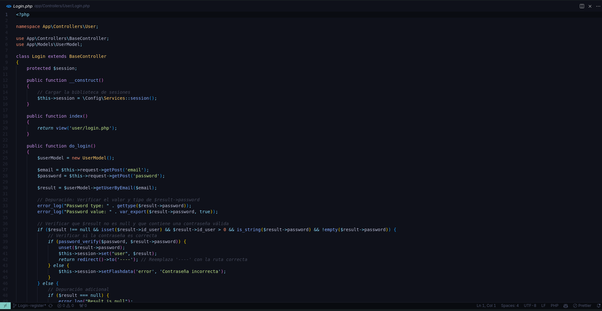

# Visual Studio Code
> Esto es una personalización sobre Visual Studio Code.

  

## 1º Paso

Descargar el json de la configuracion y pegarlo en la siguiente ruta:

`C:\Users\usuario\AppData\Roaming\Code\User`

## 2º Paso

Descargar las siguientes extensiones:

+ Auto Rename Tag
+ Better Comments
+ Error Lens
+ Github Copilot
+ Image preview
+ Live Server
+ Icons
+ Material Theme
+ Path Intellisense
+ Prettier - Code formatter
+ Subtle Match Brackets

**Listo ahora podes utilizar tu visual a gusto :)**
