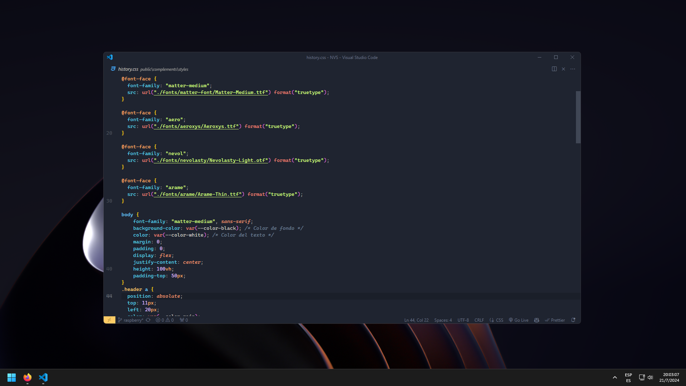

### Preview

  

### README

#### Importing JSONC File to Visual Studio Code Settings

To import the JSONC file into your Visual Studio Code settings, follow these steps:

1. Locate the directory: `C:\Users\usuario\AppData\Roaming\Code\User`.
2. Place the JSONC file (typically `settings.jsonc`) in this directory.
3. Restart Visual Studio Code to apply the settings.

#### Extensions and Brief Descriptions

Here are essential extensions for enhancing your development experience in Visual Studio Code:

- **Auto Rename Tag**: Automatically rename paired HTML/XML tags.
- **Beautify css/sass/scss/less**: Beautify/format CSS, Sass, SCSS, and Less code.
- **Better Comments**: Improve your code commenting with annotations, alerts, queries, and more.
- **CodeSnap**: Quickly generate code snippets from your code.
- **GitHub Copilot**: AI-powered code completion from GitHub.
- **HTML to CSS autocompletion**: Autocompletion for CSS class names in HTML.
- **Image preview**: Show image previews in the editor.
- **Path Intellisense**: Autocompletes filenames in your code.
- **Prettier - Code formatter**: Automatically format your code for consistent style.
- **Subtle Match Brackets**: Enhances bracket matching in subtle ways.

#### Deployment for Visualizing Code

To launch your code for visualization, consider using the following extensions:

- **Live Server**: Launch a local development server with live reload feature.
- **Live Preview**: Instantly see live previews of HTML, Markdown, and more.

#### Themes

Enhance your Visual Studio Code interface with these themes:

- **GlassIt-VSC**: A transparent theme for a sleek look.
- **Icons**: Icon theme for better file and folder visualization.
- **Ayu**: A simple and elegant theme with bright colors for all day long.

---

This README provides essential information to set up and enhance your Visual Studio Code environment for efficient coding and development.
